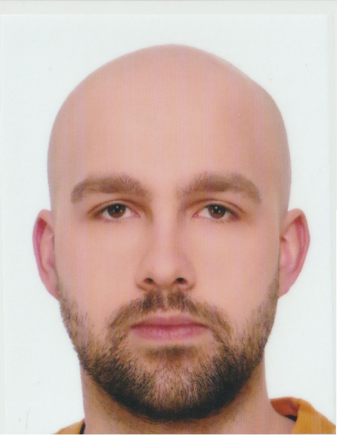

    
    
        <b> Milosz Sultanowski</b>
    

    

## Contact

e-mail: milosz.sultanowski@gmail.com  
Linkedin: https://www.linkedin.com/in/mi%C5%82osz-su%C5%82tanowski-5aaaa3200/  
Github: https://github.com/sk-rp-ta  
Codewars: https://www.codewars.com/users/sk-rp-ta  

## About me

I am a 24y old c++ software engineer located in Poland. Open-minded and actively seeking new opportunities to enhance my skillset, highly motivated to learn new technologies. My goal is to constantly improve the quality of my code by expanding programming knowledge.

Read books:  
Github: https://github.com/sk-rp-ta/books  

Solved problems:  
https://www.codewars.com/users/sk-rp-ta/completed_solutions  

## Employment History

### Junior Software Engineer

BCF Software  
Dec 2021 - Jul 2022  

### Software Engineer
Nokia Solutions and Networks  
Jul 2022 - Present

## Education

### Engineer of Automatics and Robotics  
Wroclaw University of Science and Technology  
Oct 2017 - Feb 2021  
Grade 4.5

### Master of Automatics and Robotics  
Wroclaw University of Science and Technology  
Feb 2021 - Jul 2022  
Grade 4.5

## Skills

c++ :black_circle: :black_circle: :black_circle: :black_circle: :white_circle:  
GTest :black_circle: :black_circle: :black_circle: :black_circle: :white_circle:  
Git :black_circle: :black_circle: :black_circle: :black_circle: :white_circle:  
Linux :black_circle: :black_circle: :black_circle: :black_circle: :white_circle:  
Bash :black_circle: :black_circle: :black_circle: :black_circle: :white_circle:  
c :black_circle: :black_circle: :black_circle: :white_circle: :white_circle:  
Python :black_circle: :black_circle: :white_circle: :white_circle: :white_circle:  
Java :black_circle: :white_circle: :white_circle: :white_circle: :white_circle:  

## Languages
English C1  
Japanese A1  

## Hobbies
* Cooking
* Football
* Video games
